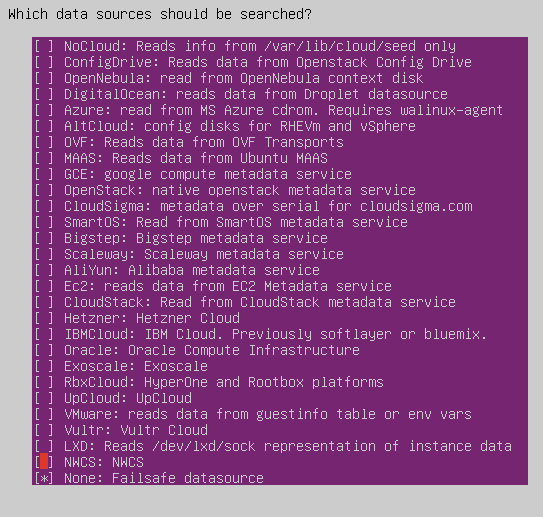

# Staging Deployment on Remote Server

- Pre-requisite : Create Ubuntu VM 
- Install OpenSSH server
  ```
  $ sudo apt install ssh
  ```
- Enable SSH Service
  ```
  sudo systemctl enable ssh
  ``` 
- Verify SSH Service Status
  ```
  sudo systemctl status ssh
  ```
- Set Timezone
  ```
  timedatectl list-timezones
  sudo timedatectl set-timezone Asia/Manila 
  ```
- Disable cloud-init in Ubuntu
  - Prevent start 
    ```
    • Create an empty file to prevent the service from starting
        
      $ sudo touch /etc/cloud/cloud-init.disabled
    ```
  - Uninstall
    ```
    • Disable all services (uncheck everything except "None"):
      
      $ sudo dpkg-reconfigure cloud-init
    ``` 
    

  - Uninstall the package and delete the folders
    ```
      $ sudo apt-get purge cloud-init -y
      $ sudo rm -rf /etc/cloud/ && sudo rm -rf /var/lib/cloud/
    ```

  - Restart the computer
    ```
     $ sudo reboot
    ```

- DISABLE AND REMOVE APPARMOR
  ```
   AppArmor is a Linux Security Module implementation of name-based mandatory access controls.
  ```
    - Stop apparmor service using systemd.
      ```
       $ sudo systemctl stop apparmor
      ```
    - Disable apparmor from starting on system boot.
      ```
       $ sudo systemctl disable apparmor
      ```
    - Remove apparmor package and dependencies using apt.
      ```
       $ sudo apt remove --assume-yes --purge apparmor
      ```
    - Restart the computer
      ```
       $ sudo reboot
      ```
- To disable the wait-online service to prevent the system from waiting on a network connection
  ```
   $ sudo systemctl disable systemd-networkd-wait-online.service
  ```
- To prevent the service from starting if requested by another service
  ```
   $ sudo systemctl mask systemd-networkd-wait-online.service
  ```
- After all updates are applied, remove any leftover, unnecessary packages by running the following commands:
  ```
    $ sudo apt autoremove -y
    $ sudo apt autoclean
  ```
- Setup SSH key
  - Check for existing SSH keys
    ```
     $ ls -al ~/.ssh
    ```
  - Generate SSH key (recommended: ED25519)
    ```
     $ ssh-keygen -t ed25519 -C "joeyt@wallem.com.ph"
     
        When prompted:
            
            File: press Enter (default: ~/.ssh/id_ed25519)
            Passphrase: optional but recommended
     
    ```
  - Start SSH agent
    ```
     $ eval "$(ssh-agent -s)"
    ```
  - Add key to agent
    ```
     $  ssh-add ~/.ssh/id_ed25519
    ```
  - Copy your public key
    ```
     $ cat ~/.ssh/id_ed25519.pub
    
     Note: Copy the full output (starts with ssh-ed25519).
    ```
  - Add key to Git platform
    ```
    For GitHub
        Go to: https://github.com/settings/keys
        Click New SSH key
        Paste your key
    For GitLab
        Go to: https://gitlab.com/-/profile/keys
        Paste your key
    ```
  - Test connection
    ```
    $ ssh -T git@192.168.197.18
    
    Expected:
        
        Hi username! You've successfully authenticated...
    ```
- Install Git
  ```
   $ sudo git init
  ```
- Create repo and make mis as folder owner
  ```
   $ sudo mkdir /opt/cwr
   $ sudo chown -R mis:mis /opt/cwr
  ```
- Initialize Git repository
  ```
   cd /opt/cwr
   $ sudo git init
  ```
- Git Initial Config
  ```
   $ sudo git config --global user.name "Joey Tapic"
   $ sudo git config --global user.email "mis@wallem.com.ph"
   $ sudo git config --global core.autocrlf input
   $ sudo git config --global init.defaultBranch main
   $ sudo git config --global --add safe.directory /opt/cwr
  ```
- Check Conf
  ```
   $ sudo git config --list
  ```
- Add the remote repository
  ```
   git remote add dev git@192.168.197.18:cwr/dev/cwrv1.git
  ```
- Pull from repo
  ```
   git pull dev main
  ```
- Install Docker
  - Remove old versions (if any)
    ```
     $ sudo apt remove docker docker-engine docker.io containerd runc -y
    ```
  - Update packages
    ```
     $ sudo apt update
     $ sudo apt install ca-certificates curl gnupg -y
    ```
  - Add Docker’s official GPG key
    ```
      $ sudo install -m 0755 -d /etc/apt/keyrings

      $ curl -fsSL https://download.docker.com/linux/ubuntu/gpg | \
        sudo gpg --dearmor -o /etc/apt/keyrings/docker.gpg
    
      $ sudo chmod a+r /etc/apt/keyrings/docker.gpg
    ```
  - Add Docker repository
    ```
      echo \
      "deb [arch=$(dpkg --print-architecture) \
      signed-by=/etc/apt/keyrings/docker.gpg] \
      https://download.docker.com/linux/ubuntu \
      $(. /etc/os-release && echo $VERSION_CODENAME) stable" | \
      sudo tee /etc/apt/sources.list.d/docker.list > /dev/null
    ```
  - Install Docker Engine
    ```
      $ sudo apt update
      $ sudo apt install docker-ce docker-ce-cli containerd.io docker-buildx-plugin docker-compose-plugin -y
    ```
  - Verify installation
    ```
      $ sudo docker --version
    ```
  - Run Docker without sudo
    ```
      $ sudo usermod -aG docker $USER
     
      Then apply:
        
        newgrp docker
     
      Test:
        
        docker ps
    ```
  - Enable Docker on boot
    ```
     $ sudo systemctl enable docker
    ```
- Running Docker container 
  - Change to staging docker folder
    ```
    cd docker_staging_remote
    ```
  - Create the Dockerfile
    ```
    docker compose build
    ```
  - Running the containers
    ```
    docker compose up -d
    ```
- Setup Django Admin portal
  - Migrate Database:
      ```
      docker compose exec backend python3 manage.py makemigrations
      docker compose exec backend python3 manage.py migrate
      ```
   - Collect static files:
      ```
      docker compose exec backend python3 manage.py collectstatic
     ```
  - Create superuser (admin account):
      ```
      docker compose exec backend python3 manage.py createsuperuser
      ```
  - Super User
      ```
      mis/wallem1234
     ```
## Note
```
 Load test data for testing
```